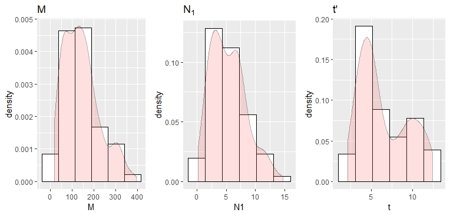
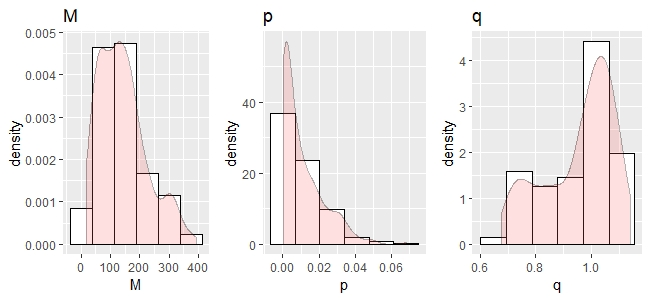
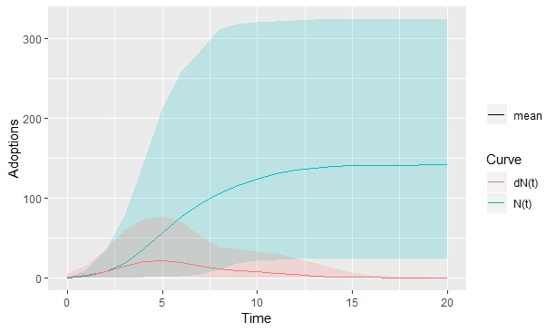
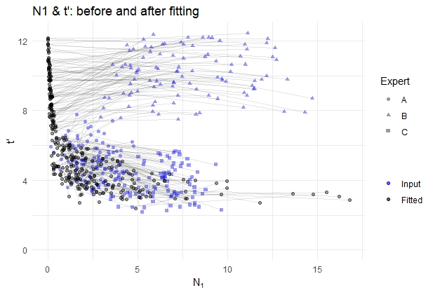

# DCGen

DCGen is a package diffusion curve generator, having been developed to generate diffusion curves relating to technology adoption or product sales.  The package was undertaken at the University of Sheffield, in the United Kingdom, and is a unique combination of two separate bodies of work; the Bass model of product diffusion and Bayesian expert elicitation (Grimm et al 2018).  This combination allows probabilistic estimates of diffusion that are based on established theory and modelling methods to be generated.
The diffusion estimates produced by the DCGen can be used for a variety of purposes, including budget impact modelling, infectious disease modelling, dynamic cost-effectiveness modelling (Grimm et al 2016 and Grimm et al 2017) and sales forecasting.
From this Homepage, you can go straight to the DCGen, take a tutorial, read more about the underlying methods, look at a bibliography of papers relating to our DCGen or check out FAQs.  If you have any comments or suggestions, you can also contact us.


### Load DCGen
```r
library(DCGen)

```


### Input elicitation data

```r
ExpA = new_expert("A", "Triangle", c(54.2, 10, 150), "Triangle", c(2.3, 0, 5), "Triangle", c(5.1, 3, 8))

ExpB = new_expert("B", "Triangle", c(158.8, 30, 230), "Triangle", c(5.7, 2, 15), "Triangle", c(9.9, 7, 13))

ExpC = new_expert("C", "Triangle", c(204.4, 30, 410), "Triangle", c(7.1, 2, 10), "Triangle", c(3.5, 2, 6))


```


### Aggregate elicitation data
```r
experts <- aggregate_experts(list(ExpA, ExpB, ExpC))
print(experts)

```

#### Linear pooling

```r
pars <- rand_parameters(experts, 300, method="linear", type="continuous")
head(pars)

```

#### Mixture model

```r
pars <- rand_parameters(experts, 300, method="mixture", type="continuous")
head(pars)

```


### Translate elicitation data to Bass Diffusion Curves
```r
cvs <- generate_diffusion_curves(pars, t_max=20)
```

#### Visualisation

Visualise input distributions

```r
visualise_inputs(pars)
```


Visualise fitted parameters

```r

visualise_fitted(pars)
```


Visualise output curves

```r
visualise_curves(cvs, dN=T)
```


#### Validation

Compare input parameters to the fitted parameters.
If points shift much, elicitation results probably do not fit the Bass diffusion function.
For the following example, the Expert B provided inappropriate inputs.

```r
visualise_comparing(pars)
```


### Webapp

An online webapp developed with RShiny is available on 

[Sheffield]()

or [Source codes](https://github.com/Sheffield-Diffusion-Curve/DCGApp)


### References:
* Grimm SE, Stevens JW, Dixon S.  Estimating Future Health Technology Diffusion Using Expert Beliefs Calibrated to an Established Diffusion Model.  Value Health. 2018 Aug;21(8):944-950. doi: 10.1016/j.jval.2018.01.010.
* Grimm SE, Dixon S, Stevens JW. When Future Change Matters: Modeling Future Price and Diffusion in Health Technology Assessments of Medical Devices. Value Health. 2016 Sep - Oct;19(6):720-726. doi: 10.1016/j.jval.2016.06.002.
* Grimm SE, Dixon S, Stevens JW. Assessing the Expected Value of Research Studies in Reducing Uncertainty and Improving Implementation Dynamics. Med Decis Making. 2017 Jul;37(5):523-533. doi: 10.1177/0272989X16686766. 
